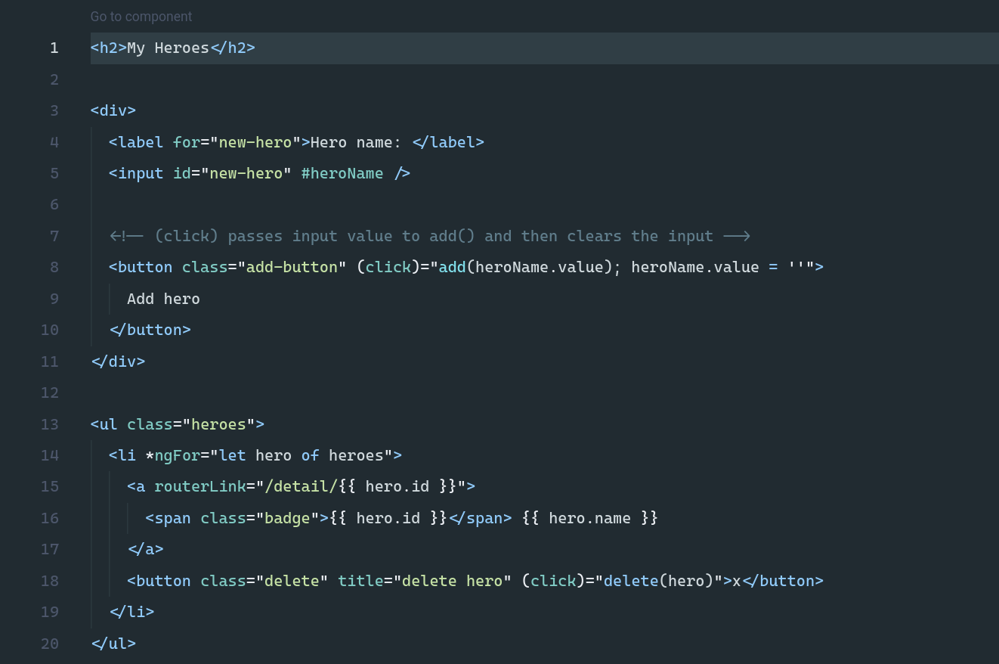
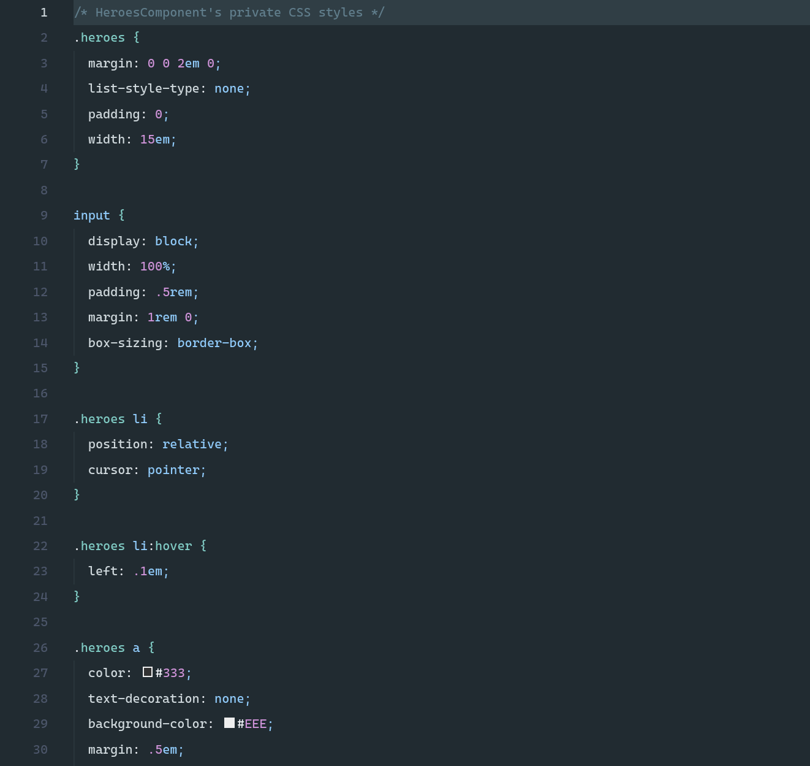
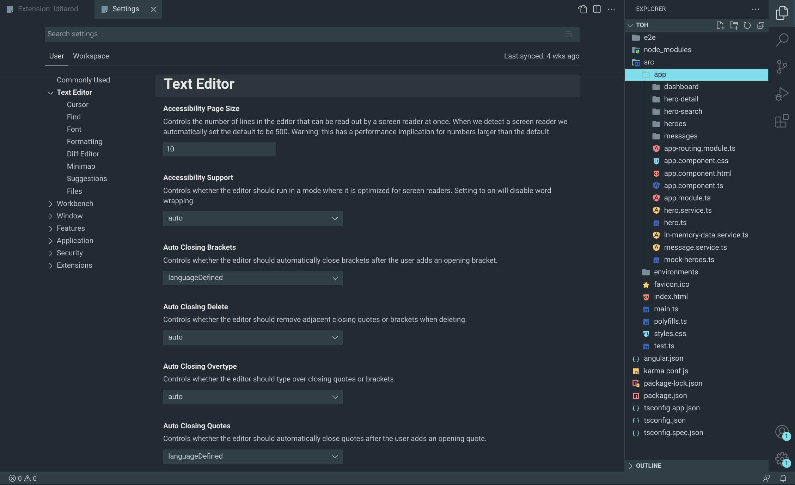

# Iditarod

A dark and cold theme for Visual Studio Code, named after the famous [Iditarod](https://iditarod.com/) sled dog race.

Basically a slightly more contrasted version of [Nord](https://www.nordtheme.com) theme, using some [Material](https://material.io/) colors.

Woof! 🐺

## Screenshots

### TypeScript (Nest)

### TypeScript (Angular)

### HTML

### CSS

### C#

### Python

### JSON

### VS Code

